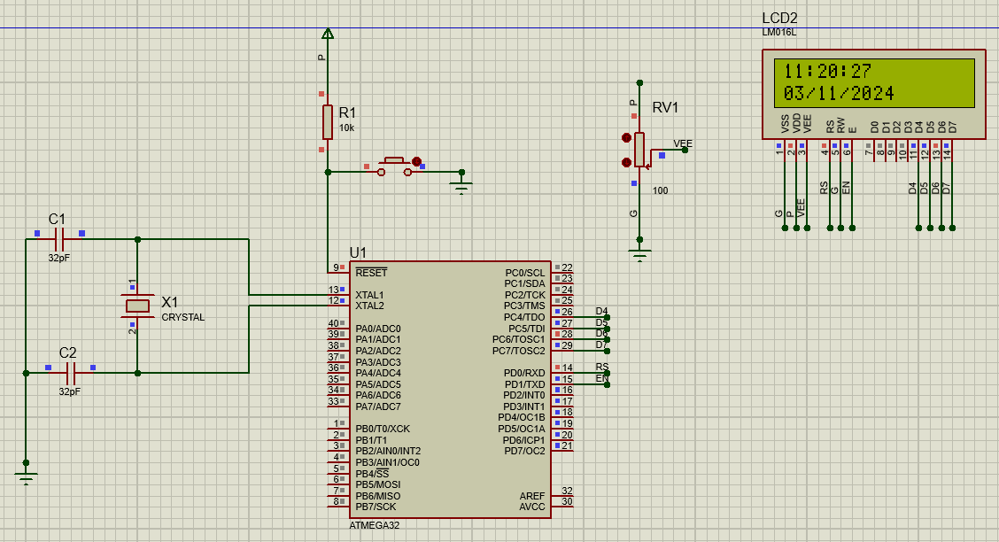
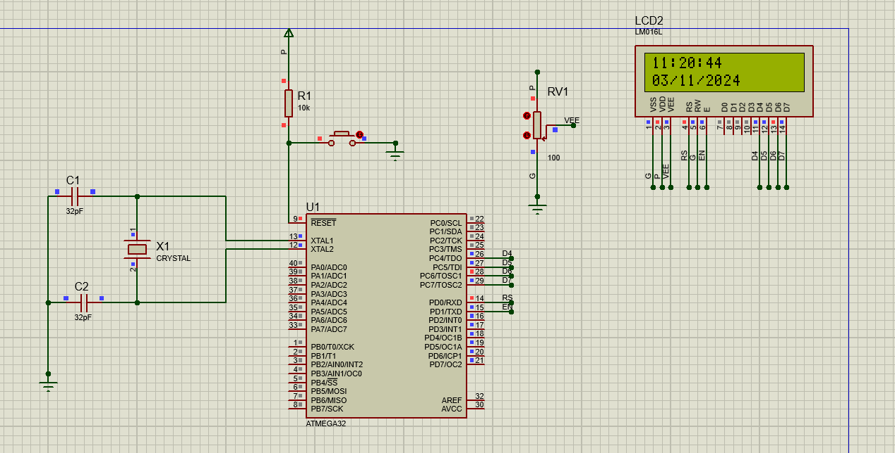

# Real-Time Digital Clock Controller (ATmega32)

*Real-time simulation of the clock cycles as seen in Proteus.*

## Project Overview
This project features a fully functional Digital Clock system designed using an AVR Microcontroller (ATmega32). The system maintains an accurate 24-hour time format (HH:MM:SS) and outputs the data to a display interface. It combines precise firmware timing with a professional hardware simulation in Proteus.

## Key Features
* **Precise Timekeeping**: Utilizes internal Microcontroller Timers to ensure 1-second accuracy for real-time tracking.
* **24-Hour Format**: Automatically handles time overflows (60 seconds to 1 minute, 60 minutes to 1 hour, 24 hours to Reset).
* **Interactive Simulation**: Includes a comprehensive Proteus project file (.pdsprj) for immediate hardware testing.
* **Visual Documentation**: Features a high-quality Animation GIF demonstrating the clock in action.

## Technical Stack
* **Hardware**: ATmega32 Microcontroller (AVR Architecture).
* **Software/Firmware**: C Language (main.c).
* **Simulation Tool**: Proteus Design Suite.
* **Documentation**: Technical Report (PDF) and Logic Flowchart.

## Logic Flowchart
The system operates on a continuous loop:
1. **Initialize**: Set Ports and Timer values.
2. **Interrupt/Delay**: Wait for exactly 1 second.
3. **Update Logic**: Increment seconds, then check for minute/hour carry-over.
4. **Display**: Refresh the Seven-Segment or LCD output.

## Project Schematic

*High-resolution snapshot of the circuit schematic designed in Proteus.*

## Project Structure
Based on the project directory:
* **main.c**: The core C source code containing the timing logic.
* **digital_clock.pdsprj**: The Proteus simulation file for hardware verification.
* **Clock_report[1].pdf**: Detailed technical documentation and circuit analysis.
* **digital_clock.png**: Schematic image of the circuit.
* **Animation.gif**: Animated preview of the working system.

## How to Run
1. **Simulation**: Open `digital_clock.pdsprj` in Proteus and click the 'Play' button.
2. **Firmware**:
   * Open `main.c` in your preferred AVR compiler (e.g., Microchip Studio).
   * Compile the code to generate the `.hex` file.
   * Load the `.hex` file into the ATmega32 component within the Proteus environment.
