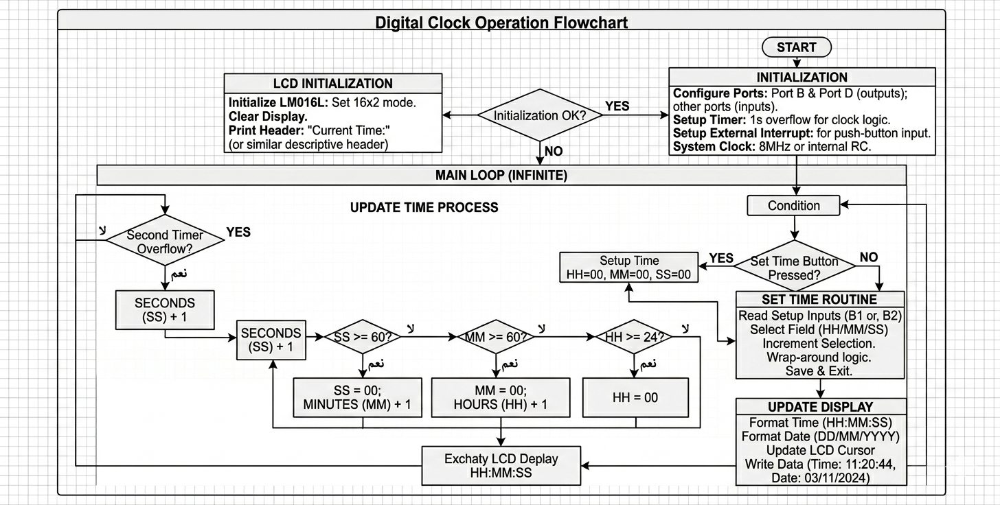

# Real-Time Digital Clock Controller (ATmega32)

## Project Overview
This project features a fully functional Digital Clock system designed using an AVR Microcontroller (ATmega32). The system maintains an accurate 24-hour time format (HH:MM:SS) and outputs the data to an LCD display (LM016L). It combines precise firmware timing with a professional hardware simulation in Proteus.

## Key Features
* **Precise Timekeeping**: Utilizes internal Microcontroller Timers to ensure 1-second accuracy for real-time tracking.
* **24-Hour Format**: Automatically handles time overflows (60 seconds to 1 minute, 60 minutes to 1 hour, 24 hours to reset).
* **Interactive Controls**: Includes hardware reset and manual adjustment capabilities via push-buttons.
* **Visual Interface**: Displays real-time clock and date data on a 16x2 character LCD.

## Technical Stack
* **Hardware**: ATmega32 Microcontroller (AVR Architecture).
* **Software/Firmware**: C Language (main.c).
* **Simulation Tool**: Proteus Design Suite.

## Logic Flowchart
The following flowchart represents the operational logic of the system, including initialization, time incrementing, and display refreshing.

### Detailed Logic Explanation
The system follows a structured execution path to ensure real-time accuracy:

1. **Initialization Phase**:
   * **I/O Ports**: Configures Port B and Port D as outputs for the LCD data and control lines.
   * **LCD Setup**: Initializes the LM016L screen in 16x2 mode and clears the display.
   * **Variables**: Sets the initial time values.

2. **The Main Loop (Infinite)**:
   * **Time Tracking**: The system monitors for a 1-second trigger (via Timer or Delay).
   * **Increment Logic**: 
     * Seconds increment by 1.
     * If `Seconds == 60`, they reset to 0 and `Minutes` increment by 1.
     * If `Minutes == 60`, they reset to 0 and `Hours` increment by 1.
     * If `Hours == 24`, the clock resets to 00:00:00.

3. **Display Update**:
   * The microcontroller converts time values to ASCII and updates the LCD display with the formatted `HH:MM:SS` string.

## Project Structure
* **main.c**: The core C source code containing the timing logic.
* **digital_clock.pdsprj**: The Proteus simulation file for hardware verification.
* **Clock_report[1].pdf**: Detailed technical documentation.
* **flowchart.png**: Visual logic flowchart of the firmware.
* **Animation.gif**: Animated preview of the working system.

## How to Run
1. **Simulation**: Open `digital_clock.pdsprj` in Proteus and click the 'Play' button.
2. **Firmware**:
   * Open `main.c` in an AVR compiler (e.g., Microchip Studio).
   * Compile the code to generate the `.hex` file.
   * Load the `.hex` file into the ATmega32 component within Proteus.
